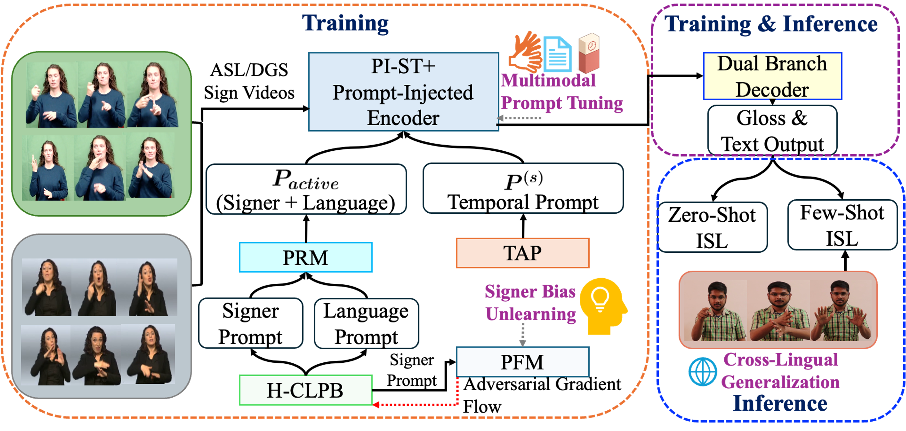
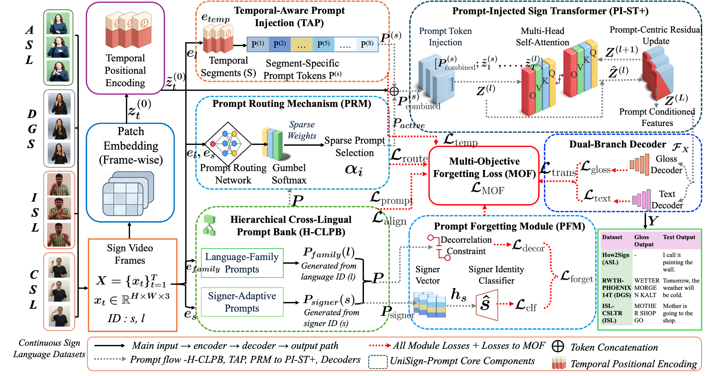

# 🚀 **UniSign-Prompt: Prompt-Space Signer Unlearning with Parameter-Efficient Cross-Lingual Sign Language Translation**

------------------------------------------------------------------------

## Overview

**UniSign-Prompt** proposes a novel **prompt-injected architecture** for
**continuous sign language translation (SLT)** focused on:

❗ **Prompt-Space Signer Unlearning**: adversarially suppresses
signer-identifiable information in the prompt-conditioned adaptation
pathway while preserving translation performance.

🌐 **Cross-Lingual Generalization**: enables robust transfer across
American Sign Language (ASL), German Sign Language (DGS), Indian Sign
Language (ISL), and Chinese Sign Language (CSL).

⚡ **Low-Resource Robustness**: superior zero-shot and few-shot ISL
performance.

------------------------------------------------------------------------

## 🎁 **Key Highlights**

📌 **Multimodal Prompt Tuning** using **Prompt-Injected Sign Transformer
Plus (PI-ST+)**, **Hierarchical Cross-Lingual Prompt Bank (H-CLPB)**,
**Temporal-Aware Prompt Injection (TAP)**, and **Prompt Routing
Mechanism (PRM)** for parameter-efficient cross-lingual adaptation.

📌 **Prompt-Space Signer Unlearning** via **Prompt Forgetting Module
(PFM)** with adversarial forgetting and decorrelation, while
signer-adaptive prompts are disabled at inference.

📌 **Cross-Lingual Generalization** through **H-CLPB**, enabling
scalable transfer across ASL, DGS, ISL, and CSL.

📌 **Temporal-Aware Prompt Adaptation** via **TAP** for long sign
sequences, segment-wise adaptation.

📌 **Dynamic Prompt Selection** via **PRM** with Gumbel-softmax routing,
reducing inference overhead.

📌 **Dual-Branch Decoder** producing both **gloss** and **spoken
language text** outputs.

📌 **Multi-Objective Forgetting (MOF) Loss** jointly optimizing
translation accuracy, signer forgetting, cross-lingual alignment, prompt
sparsity, and temporal smoothness.

📌 **Unlearning Evaluation** using post-hoc signer classification,
membership-inference attack (MIA), and gold-standard retraining.

📌 **Consistent Results** on ASL (How2Sign), DGS (RWTH-PHOENIX14T), ISL
(ISL-CSLTR), and CSL (CSL-Daily).

------------------------------------------------------------------------

## 🖼️ **Architecture Overview**

### 🔷 **Overall System Architecture**



### 🟣 **Detailed Architecture with Module Breakdown**



Module references in [`models/`](models/): -
`prompt_injected_sign_transformer.py` → **PI-ST+** (Prompt-Injected Sign
Transformer Plus) - `hierarchical_prompt_bank.py` → **H-CLPB** -
`tap_module.py` → **TAP** - `prompt_routing_mechanism.py` → **PRM** -
`prompt_forgetting_module.py` → **PFM** - `decoder.py` → **Dual-Branch
Decoder** - `unisign_prompt.py` → Overall **UniSign-Prompt** model
integration

------------------------------------------------------------------------

## 📂 **Dataset Structure**

Folder structure under `datasets/`:

``` plaintext
datasets/
├── how2sign_[train/val/test]_meta.csv
├── rwth_[train/val/test]_meta.csv
├── isl_[train/val/test/zero_shot/few_shot_*]_meta.csv
├── CSL-Daily-groundtruth-[train/dev/test].stm
├── [language]_src_vocab.txt
├── [language]_trg_vocab.txt
├── gloss_dict.npy
```

  ------------------------------------------------------------------------------------------
  Dataset           Language   Train/Val/Test       Signers   Gloss Vocab  Target Language
  ----------------- ---------- -------------------- --------- ------------ -----------------
  How2Sign          ASL        29k/3k/3k            11        --           English

  RWTH-PHOENIX14T   DGS        7096/519/642         9         1066         German

  ISL-CSLTR         ISL        500/100/100          7         1036         English

  ISL Zero-Shot     ISL        0/100/100            7         1036         English

  ISL Few-Shot      ISL        50/100/100           7         1036         English

  CSL-Daily         CSL        18,401/1,077/1,176   10        2000         Chinese
  ------------------------------------------------------------------------------------------

------------------------------------------------------------------------

## ⚙️ **Setup**

``` bash
pip install -r requirements.txt
```

Training:

``` bash
python train.py --dataset How2Sign
```

Evaluation:

``` bash
python evaluate_extended.py --dataset ISL-CSLTR --split zero_shot --checkpoint checkpoints/ISL-CSLTR_UniSignPrompt_best.pth
```

------------------------------------------------------------------------

## 🏆 **Results Summary**

### 🔵 **Translation Quality (BLEU-4 ↑, WER/Text-WER ↓)**

  Dataset         BLEU-4 ↑   WER/Text-WER ↓
  --------------- ---------- ----------------
  ASL             23.0       38.4
  DGS             22.3       37.4
  ISL Zero-Shot   14.5       46.0
  ISL Few-Shot    17.0       43.4
  CSL             20.9       38.8

### 🟣 **Signer Bias Unlearning**

  --------------------------------------------------------------------------
  Dataset     Signer Accuracy ↓   MIA Success ↓  ΔSA ↓ ΔMIA ↓ BLEU-4 Gap ↓
  ----------- ------------------- -------------- ----- ------ --------------
  DGS         13.4%               52.3%          1.3   1.4    1.4

  ISL         18.6%               --             --    --     1.9
  Zero-Shot                                                   

  ISL         16.7%               53.2%          1.6   2.1    1.5
  Few-Shot                                                    
  --------------------------------------------------------------------------

### 🟢 **Efficiency**

  Dataset   Params ↓   Latency ↓
  --------- ---------- ----------------
  ASL       49.6M      58.7 ms/sample
  DGS       49.6M      55.2 ms/sample
  ISL       49.6M      53.8 ms/sample
  CSL       49.6M      56.4 ms/sample

------------------------------------------------------------------------

## 📜 **Citation**

``` bibtex
@article{unisignprompt2026,
  title={UniSign-Prompt: Prompt-Space Signer Unlearning with Parameter-Efficient Cross-Lingual Sign Language Translation},
  author={Elakkiya R},
  year={2026}
}
```

------------------------------------------------------------------------

## 📝 **License**

MIT License
